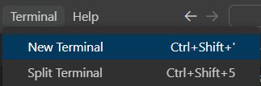
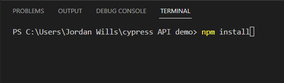
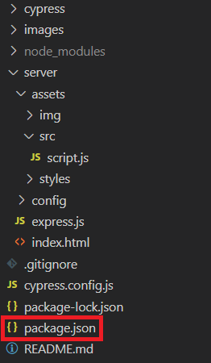
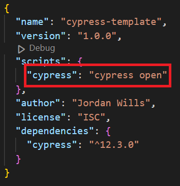
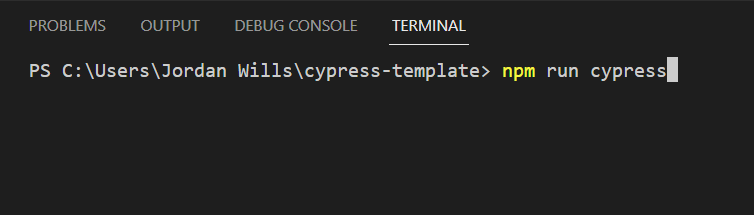

## Cypress API demo

 

A blank Cypress project, with a simple navigation test

 

#

 

### Prerequisite applications

- [ ] [Git](https://git-scm.com/downloads)
- [ ] [Node.js](https://nodejs.org/en/download/)
- [ ] [VSCode](https://code.visualstudio.com/download)

#

 

### Getting started

 

    
Hide/Show

1. Open a terminal, by navigating to "Terminal > New Terminal" along the top navigation bar.
   
   
2. Once open, type the following command: "npm install", and press enter.
   
   
3. Open the *package.json* file in your folder hierarchy.   
   
   

4. Identify the name of a *script* you want to run, in this case we will use "cypress"
   
   

5. In your terminal, type the following command: "npm run cypress", and press enter.
   
   

 

#

 

### Task

 

Using the domain [https://the-internet.herokuapp.com](https://the-internet.herokuapp.com), create some automation using any of the available HTML examples on the website. There should be at least 5 different examples tested. 

A Cypress example is available in [cypress\e2e\example.cy.js](cypress\e2e\example.cy.js), showing the proper setup of fixtures and POM.